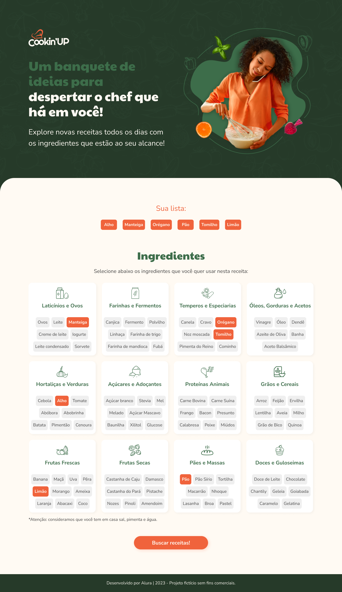
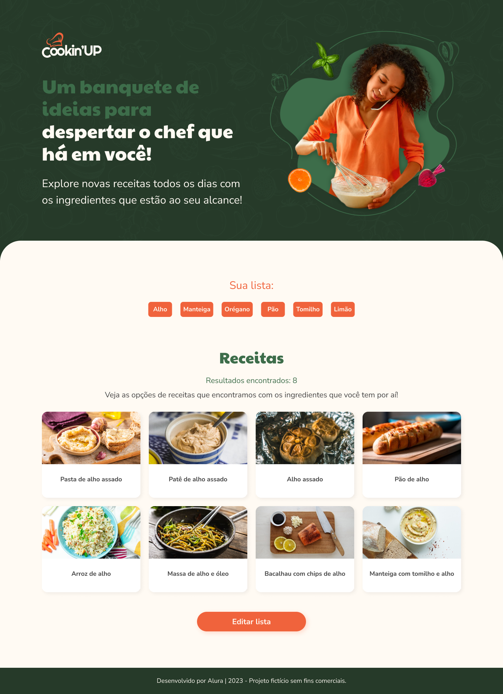

# Cookin' Up!

Projeto feito para o curso da Alura **Vue 3: entendendo componentes, diretivas e reatividade no framework**.





No Cookin' Up, você vai selecionando ingredientes para construir a sua lista de ingredientes. Em seguida, é possível buscar as receitas possíveis de serem feitas com os ingredientes da sua lista!

## Setup Recomendado

[VSCode](https://code.visualstudio.com/) + [Volar](https://marketplace.visualstudio.com/items?itemName=Vue.volar) + [TypeScript Vue Plugin (Volar)](https://marketplace.visualstudio.com/items?itemName=Vue.vscode-typescript-vue-plugin).

Desabilite a extensão Vetur, caso a tenha instalada no seu VSCode.

## Suporte para arquivos `.vue` no TypeScript

Nos editores de código, precisamos do [TypeScript Vue Plugin (Volar)](https://marketplace.visualstudio.com/items?itemName=Vue.vscode-typescript-vue-plugin) para que o serviço da linguagem TypeScript reconheça arquivos com a extensão `.vue`.

Se o serviço TypeScript nativo do VSCode não estiver rápido o suficiente para você, o Volar implementou um modo *Takeover* que é mais eficiente. Para ativá-lo, siga os passos da seção [Volar Takeover Mode](https://vuejs.org/guide/typescript/overview.html#volar-takeover-mode) da documentação.

## Setup do projeto

Após baixar ou clonar o repositório, abra o terminal do seu computador na pasta do projeto e execute o comando abaixo:

```sh
npm install
```

Aguarde a instalação das dependências. Ao finalizar, execute o seguinte comando para rodar o servidor Vite:

```sh
npm run dev
```

O Vite irá disponibilizar um link local para você abrir a aplicação em seu navegador. Esse último comando deve ser executado sempre que você abrir o VSCode e quiser visualizar o projeto.
